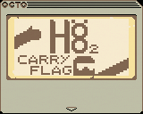

# H8-2-Carry-Flag
H8 2 Carry Flag is a chip 8 XO Chip submission for Octojam 9 (2022).

The game can be played for free at https://chromatophore.itch.io/h8-2-carry-flag

It's Time 2 Climb! Use your unusually long limbs to climb to an unusually high peak, in H8 2: Carry Flag! (nb: h8 is intended to be pronounced as "Height", due to the umlaut)

Alternatively here is an octo cart:

And this is [the rom](h8_2_carry_flag.ch8)

## Controls:
- WSAD : move current thing (see top right corner)
- Q E : select & latch left and right arm
- Z C : select & latch left and right foot
- X : select body (when limb is valid)
- 2 : cancel current limb movement
- (Controls will vary if you use the onscreen keypad)
## Goal
Reach the top of the mountain. There is an ending. There is no timer or points. 

If you would like to see the ending again, but hate climbing, you [can watch here it in gif format](art%20resources\h8_ending.gif)
## Rules
You **CAN** latch both your hands, or both your feet, to the same node. But you **CAN NOT** latch a hand on to the same node as a foot, or vice versa.

You can only extend your limbs so far. There is an **indicator on your chest** that shows roughly how much more extension you can achieve.
## Help!
If you scroll your current latch point off the screen and get stuck, use the 'cancel current limb movement' button to put it back where it was, and adjust your body.

If you can't work out where to go, or want to know how far up you are, there is a 'height_map.png' file available, which is an image file showing where all the nodes are on the cliff face.
## Also
If you leave the game running and look at a different tab, the frame rate limiter may not function correctly, resulting in the game running very fast. If you leave it for a long time, eventually it will catch back up and play normally again.
## Other
This is a spiritual? sequel to h8, a mountaineering simulator game for Octojam IV. It was a collaboration project between myself (aka Mastigophoran) and Taqueso. Unfortunately, I was too busy with work that really I only was able to offer the initial idea, and helped a little with the drawing loops. The rest of that project was all Taqueso's work, and I fondly remember the many wonderful ideas he implemented, as well as those that fell on the cutting room floor. I decided perhaps a sequel would be a good project to do for Octojam 9, and go from Superchip up to XO-Chip, and try to implement some of the ideas we'd had in our heads when we butted up against the realities of Superchip.

[You can play the original h8 here](https://johnearnest.github.io/Octo/index.html?gist=350a47c19c055f8e508c4cc573e718ae)
[It's source is available here](https://github.com/jdeeny/h8-octojam2017)